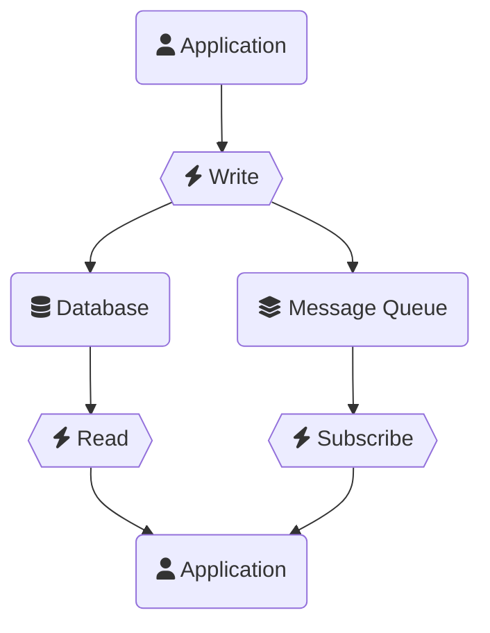
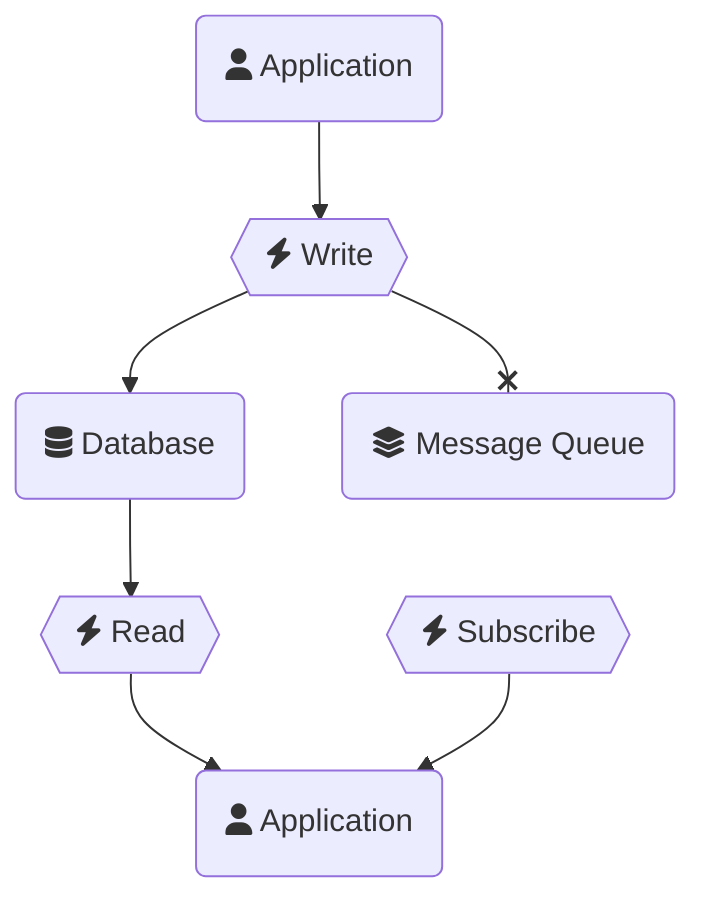
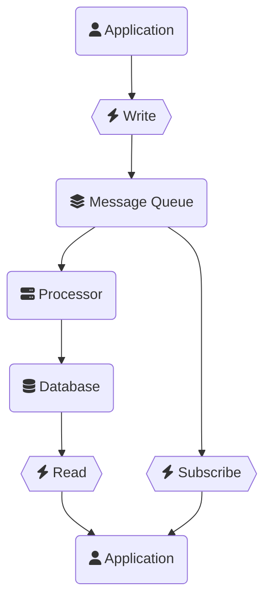
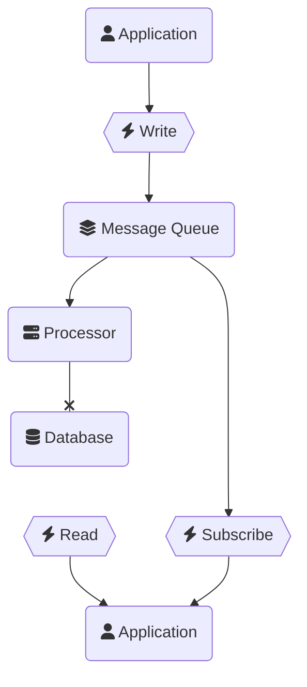
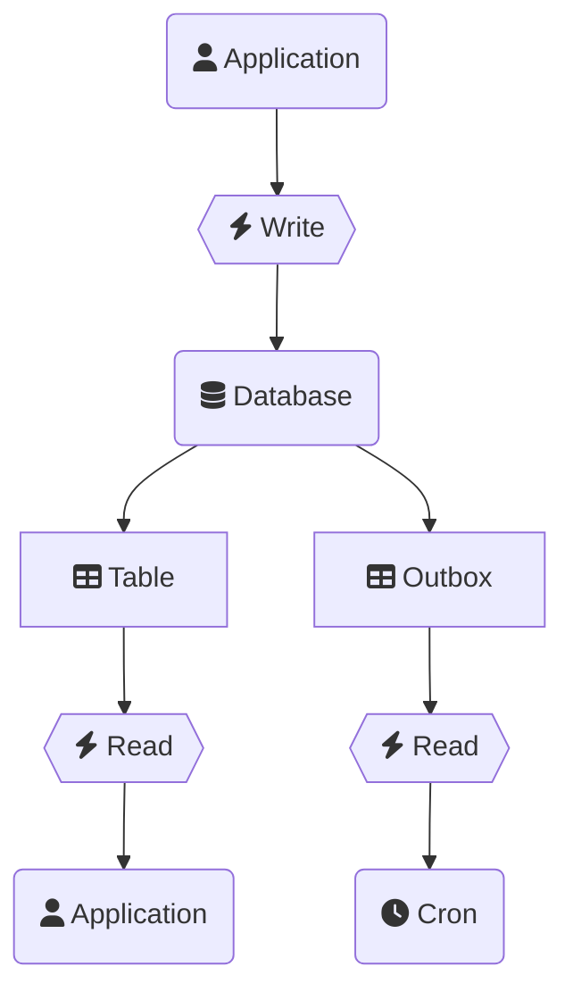
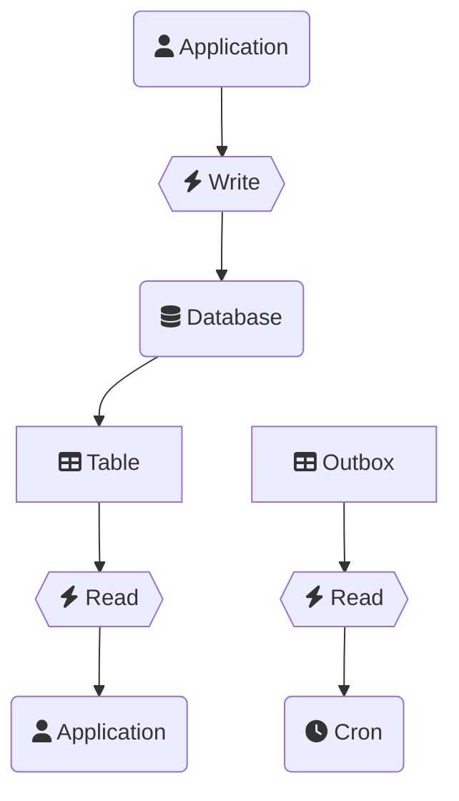
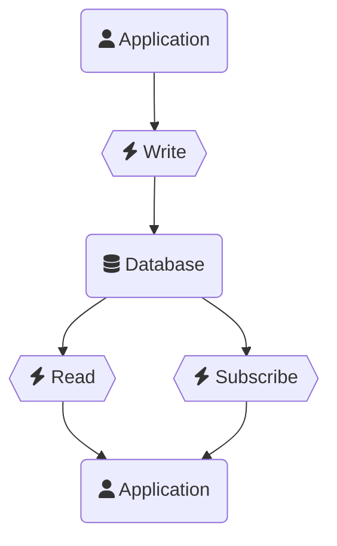
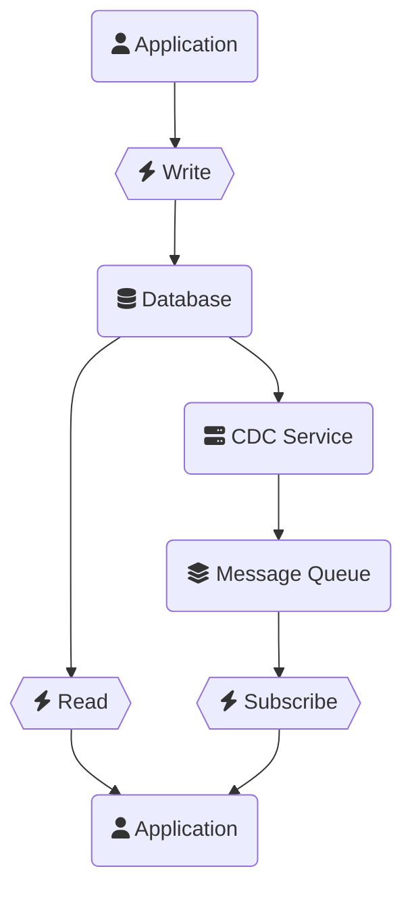
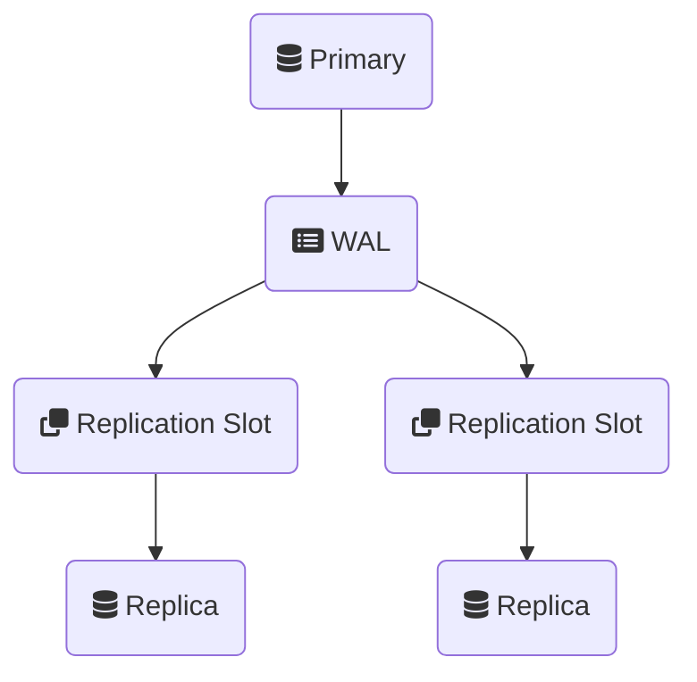
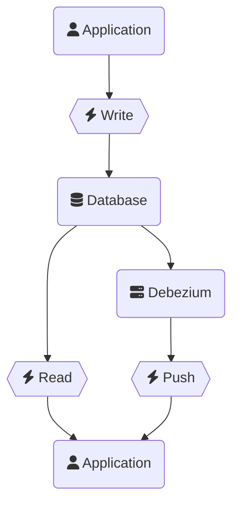

---
# You can also start simply with 'default'
theme: default
# random image from a curated Unsplash collection by Anthony
# like them? see https://unsplash.com/collections/94734566/slidev
# background: /cover.png
# some information about your slides (markdown enabled)
title: "Write Once, Stream Everywhere: Transforming Your Data into Events"
author: Tyler Benfield
info: |
  ## Slidev Starter Template
  Presentation slides for developers.

  Learn more at [Sli.dev](https://sli.dev)
# apply unocss classes to the current slide
class: text-center
# https://sli.dev/features/drawing
drawings:
  persist: false
# slide transition: https://sli.dev/guide/animations.html#slide-transitions
transition: slide-left
# enable MDC Syntax: https://sli.dev/features/mdc
mdc: true
# open graph
# seoMeta:
#  ogImage: https://cover.sli.dev
---

# Write Once, Stream Everywhere

## Transforming Your Data into Events

---
layout: two-cols-header
---

# Why streaming?

::left::

<h3> <tabler:activity /> Live updates</h3>

UX expectations are always rising. Linear is an example of excellent UX differentiating a product.

<h3> <tabler:users /> Collaboration</h3>

Live collaboration is carving out its own space with dedicated solutions like PartyKit.

<h3> <tabler:logs /> Audit logs</h3>

Capturing an audit trail is critical for many businesses to meet compliance standards.

::right::

<h3> <tabler:arrow-ramp-right /> Side effect workflows</h3>

Send a welcome email on user sign up, update a Stripe invoice when a customer changes email, etc.

<h3> <tabler:bell-ringing /> Push notifications</h3>

In-app and mobile notifications are table stakes for delivering updates (and the occasional marketing nudge).

<h3> <tabler:cloud-up /> Synchronization</h3>

Businesses operate on multiple systems that need to reflect accurate data.

---
layout: image-right
image: /train-route.png
---

<h1> <tabler:train /> Story Time </h1>

<div />

A nice 9-hour train ride from NC to DC with scenic views. Sounds fantastic!

<v-click>

Actually a 12-hour ride with 5 delays caused by engine issues and freight traffic. Not so great.

</v-click>

<v-click>

What does a train delay have to do with event streaming?

</v-click>

---
layout: two-cols-header
---

# Consistency Feels Good

Even if they're delivering bad news, having accurate, timely updates made me feel confident.

::left::


::right::


---
layout: two-cols-header
---

# Inconsistency Feels Bad

Generic, useless, untimely, notifications are confusing and introduce uncertainty.

::left::

So I updated my TSA Precheck number with AA and received this email

- What was updated?
- I didn't touch my email preferences!
- 10 days to update mailing lists?
- Did you even save my TSA Precheck number?!

::right::


---
layout: statement
---

# Event-driven systems provide better user experiences.

<!--
Event-driven systems enable consisteny, timeliness, and accuracy.

As a developer, event-driven systems give you the flexibility to decide when and how side effects take place.
-->

---
layout: two-cols
---

<div class="h-full flex  justify-center flex-col">

# Tyler Benfield

<h3>Staff Software Engineer @ <tabler:brand-prisma />Prisma</h3>

<span>
  <tabler:brand-x /> @rtbenfield
</span>
<span>
  <tabler:brand-bluesky /> @rtbenfield.dev
</span>
<span>
  <tabler:brand-linkedin /> tylerbenfield
</span>

</div>

::right::


---
layout: two-cols
---

# Our Agenda

- Talk **event-driven architectures**

- Explore **Change Data Capture** with Postgres

- Risk a **live demo**

- **Deep dive** into protocols

- Wrap-up with **outcomes**

::right::


---
layout: section
---

<h1> <tabler:bolt /> Event-Driven Architectures</h1>

---

<h1> <tabler:trophy /> Pillars of Eventuality</h1>

A framework for comparing event-driven architectures.

<div class="flex flex-row gap-8 w-full mt-24">

<section class="border-t-12 grow basis-1 pt-2">

<v-click>

## Instant

Imperceivable latency.

No polling.

Always-active connection.

</v-click>

</section>

<section class="border-t-12 grow basis-1 pt-2">

<v-click>

## Consistent

Events match state.

Events always trigger.

Critical data is available immediately.

</v-click>

</section>

<section class="border-t-12 grow basis-1 pt-2">

<v-click>

## Ordered

Events retain order for all recipients.

</v-click>

</section>

<section class="border-t-12 grow basis-1 pt-2">

<v-click>

## Recoverable

Clients recover from disconnect.

Missed events are delivered.

Failed events can retry.

</v-click>

</section>

</div>

---
layout: two-cols
---

<h1> <tabler:git-branch-deleted /> Dual Writes</h1>

A common pattern that favors simplicity over consistency.

- Dual-write to database and message queue, either sequentially or concurrently.

- Application reads from database and consumes from the message queue independently.

::right::



---
layout: two-cols-header
title: Dual Writes - Example
---

<h1> <tabler:git-branch-deleted /> Dual Writes</h1>

::left::

```ts
async function handler(request: Request) {
  const body = await request.json();
  const data = validate(body);
  await Promise.all([
    // write data to the primary datastore
    storeData(data),
    // publish the event to the message queue
    publishMessage(data),
  ]);
  return new Response("OK");
}
```

::right::

```ts
async function handleMessage(message: Message) {
  switch (message.type) {
    case "user.created":
      return await sendWelcomeEmail(message);
    case "user.notifications.updated":
      return await updateMarketingPreferences(message);
    // ...
  }
}
```

<!--
On the left, code is writing to a database and publishing an event to a message queue concurrently.

On the right, a handler is consuming the message queue to perform some side effect.
-->

---
layout: two-cols
title: Dual Writes - Inconsistent Queue
---

<h1> <tabler:git-branch-deleted /> Dual Writes</h1>

#### **What if the database succeeds and the queue fails?**

- The application will show the correct data without processing the message queue workflows.

- Emails aren’t sent, notifications aren’t pushed, and external systems are not updated.

::right::



---
layout: two-cols
title: Dual Writes - Inconsistent Data
---

<h1> <tabler:git-branch-deleted /> Dual Writes</h1>

#### **What if the database fails and the queue succeeds?**

- Emails are sent, notifications are pushed, and external systems are updated with the incorrect data.

::right::


---

<h1> <tabler:trophy-off /> Dual Write </h1>

<div class="flex flex-row gap-8 w-full mt-24">

<section class="border-t-12 grow basis-1 pt-2">

## Instant

Changes through the message queue are pushed to the application and reflected in the database.

</section>

<section class="border-t-12 grow basis-1 pt-2">

## ~~Consistent~~

A failure on either side will cause inconsistent results and is impossible to prevent.

</section>

<section class="border-t-12 grow basis-1 pt-2">

## Ordered

Events in the message queue can retain their order.

</section>

<section class="border-t-12 grow basis-1 pt-2">

## ~~Recoverable~~

Clients can recover from the message queue, though database write failures cannot recover reliably.

</section>

</div>

---
layout: two-cols-header
---

<h1> <tabler:hourglass /> Write First, Read Eventually</h1>

The event-driven architecture dream.

::left::

- Write to a message queue first, then commit to the database in a queue processor.

- Application reads from database and consumes from the message queue independently.

::right::



<!--
Defer the database write to the message queue.

The request handler has a single task: publish the event.
-->

---
layout: two-cols-header
title: Write First, Read Eventually - Example
---

<h1> <tabler:hourglass /> Write First, Read Eventually</h1>

::left::

```ts
async function handler(request: Request) {
  const body = await request.json();
  const data = validate(body);
  await publishMessage(data);
  return new Response("OK");
}
```

::right::

```ts
async function handleMessage(message: Message) {
  switch (message.type) {
    case "user.created":
      await createUser(message);
      await sendWelcomeEmail(message);
      return;
    case "user.notifications.updated":
      await updateUser(message);
      await updateMarketingPreferences(message);
      return;
    // ...
  }
}
```

<!--
On the left, code is writing to a message queue without writing to the database.

On the right, code is receiving messages from the message queue and using that
to update the database and perform side effects.

Right side can be made idempotent to support retries.

Left side becomes consistent with only one direct outcome: the message.
-->

---
layout: two-cols-header
---

<h1> <tabler:hourglass /> Write First, Read Eventually</h1>

::left::

### **What if the queue processor fails?**

- The user is led to believe the operation succeeded.
- The database does not reflect the new state.
- Emails are sent, notifications are pushed, and external systems are updated with the incorrect data.

<v-click>

**We can retry it!**

In the meantime, the data is inconsistent.

</v-click>

::right::



---

<h1> <tabler:trophy-off /> Write First, Read Eventually </h1>

<div class="flex flex-row gap-8 w-full mt-24">

<section class="border-t-12 grow basis-1 pt-2">

## Instant

Changes through the message queue are pushed to the application, though the database update is delayed.

</section>

<section class="border-t-12 grow basis-1 pt-2">

## ~~Consistent~~

Critical data is _eventually consistent_.

A failure to process a message would cause the database to be incorrect.

Retries might recover, but the user experience would be delayed.

</section>

<section class="border-t-12 grow basis-1 pt-2">

## Ordered

Events in the message queue can retain their order.

</section>

<section class="border-t-12 grow basis-1 pt-2">

## Recoverable

The queue processor can retry until the database update succeeds.

Queue messages to the application can retry.

</section>

</div>

<!--
We've _mostly_ fixed the problem, but the UI is in an inconsistent state for some time.

We can do better!
-->

---
layout: two-cols
---

<h1> <tabler:stack-pop /> Outbox</h1>

A simple pattern for transactional consistency.

- Use a transaction to write to both the primary table and an outbox table.
- The application polls the outbox table for new events to process.
- No chance of a missed event with transaction consistency.

::right::



---
layout: two-cols-header
title: Outbox - Example
---

<h1> <tabler:stack-pop /> Outbox</h1>

::left::

```ts
async function handler(request: Request) {
  const body = await request.json();
  const data = validate(body);
  await db.transaction(async (tx) => {
    await tx.storeData(data);
    await tx.addToOutbox(data);
  });
  return new Response("OK");
}
```

::right::

```ts
async function handleCron() {
  const messages = await db.getOutboxMessages();
  for (const message of messages) {
    switch (message.type) {
      case "user.created":
        await sendWelcomeEmail(message);
        break;
      case "user.notifications.updated":
        await updateMarketingPreferences(message);
        break;
      // ...
    }
    await db.markMessageAsProcessed(message.id);
  }
}

// or publish to a message queue from the outbox
async function handleCron() {
  const messages = await db.getOutboxMessages();
  for (const message of messages) {
    await publishMessage(message);
    await db.markMessageAsProcessed(message.id);
  }
}
```

---
layout: two-cols
title: Outbox - Forgotten Write
---

<h1> <tabler:stack-pop /> Outbox</h1>

#### **What happens if we forget to write to the outbox?**

- The application will show the correct data without processing the message queue workflows.
- Emails aren’t sent, notifications aren’t pushed, and external systems are not updated.

::right::



---

<h1> <tabler:trophy-off /> Outbox</h1>

<div class="flex flex-row gap-8 w-full mt-24">

<section class="border-t-12 grow basis-1 pt-2">

## ~~Instant~~

The outbox table must be polled by the application.

</section>

<section class="border-t-12 grow basis-1 pt-2">

## Consistent

The transaction guarantees that the update and outbox message are atomic.

⚠️ The developer has to remember to always write to both!

</section>

<section class="border-t-12 grow basis-1 pt-2">

## Ordered

Events in the outbox can be ordered.

</section>

<section class="border-t-12 grow basis-1 pt-2">

## Recoverable

The application can implement retry patterns when processing messages from the outbox.

Outbox message processing can be made idempotent.

</section>

</div>

<!--
We've backtracked! Not instant and flaky consistency.
-->

---
layout: two-cols
---

<h1> <tabler:wand /> Change Data Capture</h1>

Events driven by the database.

- The application writes to the database as usual.
- The application subscribes to changes from the database and receives updates in real-time.

::right::



---
layout: two-cols
---

<h1> <tabler:wand /> Change Data Capture</h1>

A source for a message queue.

- A dedicated CDC service consumes changes from the database in real-time.
- The CDC service pushes the change events into a message queue.
- The application consumes change event messages from the message queue.

::right::



---

<h1> <tabler:trophy /> Change Data Capture</h1>

<div class="flex flex-row gap-8 w-full mt-24">

<section class="border-t-12 grow basis-1 pt-2">

<v-click>

## Instant

Changes are pushed immediately to the CDC consumer when the data is changed.

</v-click>

</section>

<section class="border-t-12 grow basis-1 pt-2">

<v-click>

## Consistent

Changes are only pushed if the data commits to the database.

No chance of forgetting to publish events when modifying data, _even with direct SQL_.

</v-click>

</section>

<section class="border-t-12 grow basis-1 pt-2">

<v-click>

## Ordered

Changes captured by CDC preserve ordering.

</v-click>

</section>

<section class="border-t-12 grow basis-1 pt-2">

<v-click>

## Recoverable

The database can retain events that have not yet been processed to enable recovery.

Consumers can implement idempotency using database-generated identifiers.

</v-click>

</section>

</div>

---

<h1> <tabler:ice-cream /> Flavors of CDC</h1>

<div class="grid grid-cols-2 gap-8 mt-16">

<section>

## PostgreSQL

Logical replication using the Write Ahead Log with streaming or scraping.

</section>

<section>

## MySQL / MariaDB

Binary log (binlog) streaming or scraping.

</section>

<section>

## MongoDB

Change streams, providing a convenient API for streaming changes from the oplog.

</section>

<section>

## CockroachDB

Changefeed jobs that push changes to webhooks, Kafka, or GCP Pub/Sub.

</section>

<section>

## Microsoft SQL Server

SQL Server Agent jobs.

</section>

<section>

## SQLite

Data change notification callbacks.

</section>

</div>

---
layout: section
---

<h1> <tabler:database /> Postgres CDC</h1>

Change Data Capture using Logical Replication

---

<h1> <tabler:vocabulary /> Terms to Know</h1>

<div class="grid grid-cols-2 gap-8 mt-16">

<v-click>
<section>

## WAL - Write Ahead Log

A log of data changes applied to the database.

</section>
</v-click>

<v-click>
<section>

## LSN - Log Sequence Number

A position in the WAL represented as a byte offset.

</section>
</v-click>

<v-click>
<section>

## Publication

A definition of tables to make available for logical replication.

</section>
</v-click>

<v-click>
<section>

## Replication Slot

An instance of a replication consumer that should be tracked by the primary to retain changes.

</section>
</v-click>

<v-click>
<section>

## Logical Replication

The concept of replicating a database by tracking changes in the form of individual record modification.

</section>
</v-click>

<v-click>
<section>

## Physical Replication

The concept of replicating a database by copying blocks of data that have been modified.

</section>
</v-click>

</div>

---

<h1> <tabler:wall /> WAL - Write Ahead Log</h1>

- Postgres uses the WAL to track every change to the database in order.

- The WAL is used to recover after a crash by replaying changes.

- The WAL can be used in logical replication to stream changes to a standby server.

- The WAL is server-level, not database level, so changes to other databases will increase the WAL file position.

<!--
The WAL is really an audit log of every conceptual change that has taken place.

It encodes a logical description of the changes, but not the underlying bytes.

This makes it useful for creative use cases like CDC.
-->

---
layout: two-cols
---

<h1> <tabler:player-track-next /> Logical Replication</h1>

- Postgres logical replication leverages the WAL to stream changes to other servers.

- Events are encoded using a chosen format that the standby can decode.

- Standby servers receive events on an always-on connection or by polling.

- Postgres retains changes until they are acknowledged by the standby server.

::right::



---
layout: two-cols
---

<h1> <tabler:player-track-next /> Replication Slots</h1>

- Replication slots track the position of each WAL consumer as an LSN.

- Postgres will retain WAL data up to the oldest LSN needed by a replication slot.

- A replication slot can only be consumed by one connection at a time.

- Postgres limits the number of replication slots that may exist as a server configuration.

::right::


---
layout: two-cols-header
---

<h1> <tabler:brand-among-us /> Replication Slots</h1>

::left::


::right::

### **What if we told the database that our application was a replica?**

- Postgres thinks the application is another database instance.

- Postgres will stream changes to the application over an active connection.

- Postgres will preserve changes until the application acknowledges them.

- Our application will need to understand encoding of WAL events.

<!--
Applications can pretend to be a database replica.

Logical replication is ideal for this because it provides the application with conceptual changes rather than byte-level changes.

Conceptual changes allow the application to process events without retaining a full copy of the database, diffing it, or other complex behavior.
-->

---
layout: section
---

<h1> <tabler:device-projector /> Demo </h1>

---
title: Demo | Example App Outline
---

<h1> <tabler:device-projector /> Example App </h1>

A simple online shop example.

Commerce is full of side effects that are perfect for an event-driven architecture.

- Customer emails
- Payment status updates
- Order fulfillment
- Inventory changes
- Refunds

Many of these are accompanied with changes in data.

- Item added to cart
- Order confirmed
- Account created

---
title: Demo | Example App Side Effects
---

<h1> <tabler:device-projector /> Example App </h1>

A simple online shop example.

### Our example side effects

- When a user adds an item to their cart we'll schedule an abandoned cart email.

- When a user checks out, we'll cancel their abandoned cart email.

- When an order is placed, we'll send the user an order confirmation.

- When an order is placed, we'll process the order fulfillment.

---
layout: two-cols
---

# Debezium

Debezium is a prebuilt solution for deploying change data capture in your application.

- Open source, self-hosted solution for capturing database changes.

- Supports a variety of databases including Postgres, MySQL, MariaDB, and MongoDB.

- Pair with a message queue for durability and delivery to applications.

- Free to host yourself with Apache License 2.0.

::right::



---

# Debezium w/ Kafka Connect

Deploy Debezium directly within a Kafka cluster.

<figure>


<figcaption class="text-center text-sm">Image sourced from <a href="https://debezium.io/documentation/reference/stable/architecture.html">Debezium documentation</a></figcaption>
</figure>

- Deployed using Apache Kafka Connect as a source connector.

- Sends CDC events into Kafka topics.

- Kafka Connect is then configured to push messages to other systems.

- Kafka provides durable storage of events.

---
layout: two-cols-header
---

# Debezium Server

Deploy Debezium as a standalone service in your infrastructure.

::left::

- Standalone service that consumes CDC events and pushes them to a destination.

- Available as a Docker image.

- Destination is responsible for durable storage of events, if needed.

- Ensure the destination supports the throughput of your database events!

::right::

<figure>


<figcaption class="text-center text-sm">Image sourced from <a href="https://debezium.io/documentation/reference/stable/architecture.html">Debezium documentation</a></figcaption>
</figure>

<!--
Be sure to keep Debezium Server healthy or it will cause a WAL backlog.
-->

---
layout: two-cols-header
---

# Debezium Engine

Deploy Debezium within a Java application.

::left::

- Java library that can be embedded in an application for custom behavior.

- Application is responsible for event delivery and durable storage of events, if needed.

- Ensure the application can handle the throughput of database events!

::right::

```java
try (DebeziumEngine<ChangeEvent<String, String>> engine =
  DebeziumEngine.create(Json.class)
    .using(props)
    .notifying(record -> {
      // do something cool with the event here
      System.out.println(record);
    }).build()
) {
  ExecutorService executor = Executors.newSingleThreadExecutor();
  executor.execute(engine);
}
```

<!--
Failure to keep up with event volume will cause a WAL backlog on the database.

The WAL will eventually reach a configured limit for the replication slot or consume all disk space.
-->

---
layout: image
image: https://media1.giphy.com/media/v1.Y2lkPTc5MGI3NjExZGd5YWtwZjlvb29wb3BzNWJmaXdzajU5NjgycGx3bHExczU0dnBkYSZlcD12MV9pbnRlcm5hbF9naWZfYnlfaWQmY3Q9Zw/l0HUcbFpqSIqOeq0E/giphy.gif
---

# Demo time!

<!--
1. Switch to screen share
2. Share projected desktop to see it in presenter
3. Show the app UI
4. Navigate TODOs
-->

---
layout: two-cols-header
---

<h1> <tabler:alert-hexagon /> Caution </h1>

CDC requires attentive monitoring.

::left::

- **Postgres** will retain WAL data up to the oldest LSN needed by a replication slot unless configured with a limit, up to the point of consuming all disk space.

- **MySQL** / **MariaDB** will retain a configured binlog size regardless of replication consumers.

::right::

```sql
SELECT
  slot_name,
  pg_size_pretty( -- human readable bytes
    pg_wal_lsn_diff( -- compute difference between two LSNs
      pg_current_wal_lsn(), -- current server LSN
      restart_lsn -- last acknowledged LSN
    )
  ) AS retained_wal_size
FROM pg_replication_slots
WHERE slot_name = 'your_slot_name';
```

<!--
CDC can recover from short-term failure, but should not be left unhealthy for a long time.

WAL is server level, not database level. Other activity can impact WAL retention.

CDC consumer should acknowledge heartbeats to prevent WAL backlog from other server activity.
-->

---
hide: true
---

<h1> <tabler:terminal /> Commands</h1>

```sql
-- Create a publication that tracks all database tables.
-- It’s possible to list specific tables here instead.
CREATE PUBLICATION "my_publication" FOR ALL TABLES;

-- Create the replication slot.
-- ! This will cause the database to start preserving WAL until the slot is active.
SELECT * FROM pg_create_logical_replication_slot(
  'my_replication_slot', -- slot name
  'pgoutput' -- encoding plugin name
);

-- Query information about the existing replication slots.
SELECT *, pg_current_wal_lsn() FROM "pg_replication_slots";
```

---
hide: true
---

<h1> <tabler:terminal /> Commands</h1>

```sql
-- Start streaming changes over the active connection.
-- Only works on a connection established as a replication connection.
START_REPLICATION SLOT "my_replication_slot" LOGICAL 0/0 (
  -- These are args to the encoding plugin used by the slot (pgoutput in this case).
  proto_version '1', -- pgoutput protocol version
  publication_names 'my_publication' -- publications to subscribe to
);

-- OR poll for new changes on a regular connection.
SELECT * FROM pg_logical_slot_peek_changes(
  'my_replication_slot', -- slot name
  NULL, -- starting LSN or NULL to resume from last position
  NULL, -- number of changes to retrieve, NULL to read to end
  'include-timestamps', 'on'  -- include transaction timestamp in results
);
```

---
hide: true
---

<h1> <tabler:terminal /> Commands</h1>

```sql
-- Advance the replication slot by acknowledging an LSN.
-- This allows Postgres to purge older WAL data.
SELECT * FROM pg_replication_slot_advance(
  'my_replication_slot', -- slot name
  '0/1A0A160' -- last LSN consumed
);

-- Drop the replication slot.
-- A replication slot with an active connection cannot be dropped!
SELECT * FROM pg_drop_replication_slot('my_replication_slot');

-- Drop the publication.
DROP PUBLICATION "my_replication_slot";
```

---
layout: section
---

<h1> <tabler:player-skip-forward /> Wrapping up </h1>

---

<h1> <tabler:trophy /> Pillars of Eventuality</h1>

<div class="flex flex-row gap-8 w-full mt-24">

<section class="border-t-12 grow basis-1 pt-2">

## Instant

Imperceivable latency.

No polling.

Always-active connection.

</section>

<section class="border-t-12 grow basis-1 pt-2">

## Consistent

Events match state.

Events always trigger.

Critical data is available immediately.

</section>

<section class="border-t-12 grow basis-1 pt-2">

## Ordered

Events retain order for all recipients.

</section>

<section class="border-t-12 grow basis-1 pt-2">

## Recoverable

Clients recover from disconnect.

Missed events are delivered.

Failed events can retry.

</section>

</div>

---
layout: image
image: /kcdc25_sponsorslide.jpeg
title: KCDC 2025 sponsors
---

---
layout: cover
background: /cover-end.png
title: End
class: text-center
---

<h1>Always COMMIT and <br/> never ROLLBACK</h1>

## Tyler Benfield

<h4>Staff Software Engineer @ <tabler:brand-prisma />Prisma</h4>

<span>
  <tabler:brand-x /> @rtbenfield
</span>
<br/>
<span>
  <tabler:brand-bluesky /> @rtbenfield.dev
</span>
<br/>
<span>
  <tabler:brand-linkedin /> tylerbenfield
</span>
